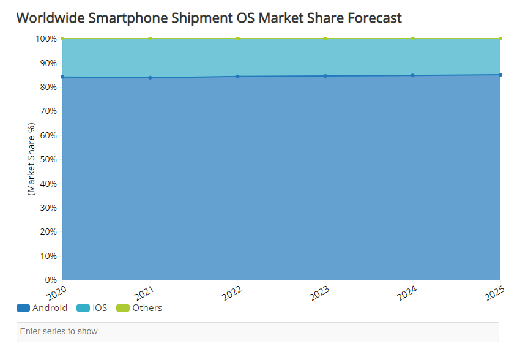
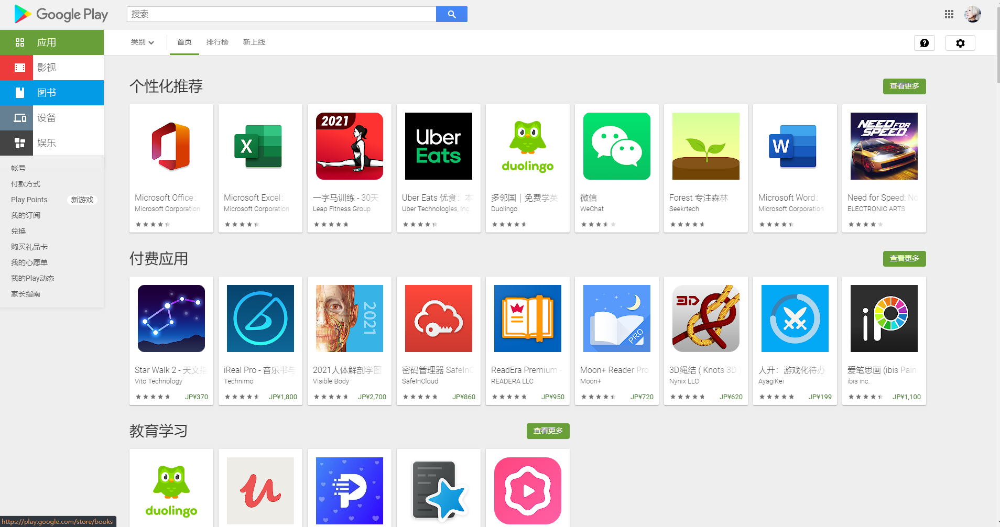

# 01.Android是什么

安卓是当今世界上最普及的智能手机操作系统。根据IDC在2020年6月发表的市场调研，安卓实际上占有了世界智能手机操作系统市场的85%，甩开了第二名的iOS一大截。

IDC的占有率预测

Worldwide Smartphone Shipment OS Market Share Forecast
https://www.idc.com/promo/smartphone-market-share

随着智能手机的普及以及安卓市场的持续大幅度成长。不仅是企业，很多个人开发者也在挑战安卓APP的开发，并将作品公开在了「Google Play」上面。当中也不乏全世界范围都很火的APP。
安卓提供了开源的许可条款，谁都可以自由地使用安卓的源码。许可条款大部分采用的都是ApacheLicenceVer2,采用安卓作为操作系统的手机开发商们不仅可以无偿使用安卓系统，也不用公开他们改变以及添加的部分。但是因为部分机能，Linux内核及其库等等是有GPL开源协议的，进行变更以及添加内容是有公开的必要的。
有开源许可条款谁都能自由地进行开发，这就是安卓的大优点。也是因为这个原因，许多厂商生产贩卖了各种各样型号的硬件设备，对于APP开发者而言就有必要对应各种各样的硬件设备进行开发了。
但是另一方面，相对于多样化的硬件设备，安卓被设计地非常柔软。比如说因为拥有吸收页面的显示大小与像素等错误的构造，所以一般的APP在其它环境运行也是很容易的。对于不能吸收的错误，使用将APP的处理本体与设计分离的构造，使每个端末只要对应设计就行了，而不要在APP的处理上面进行加工改动。
### 🤖GooGle Play 

开发好的APP能公开在Google Play上面。Androidスマホユーザーの方にはアプリのダウンロード元としておなじみでしょう。
通过Google Play，用户能入手世界上各个企业以及个人开发的APP。然后对于开发者来说，作成的APP面向全世界的用户进行无偿发布或者是有偿贩卖都是很容易的。
开发者只要最开始缴25美刀的注册手续费，后面就能自由发布贩卖APP了。这对开发者来说是十分有魅力的。
APP的发布不经由Google Play也行，其它的APP发布网站或者是个人网站都是能发布的。
